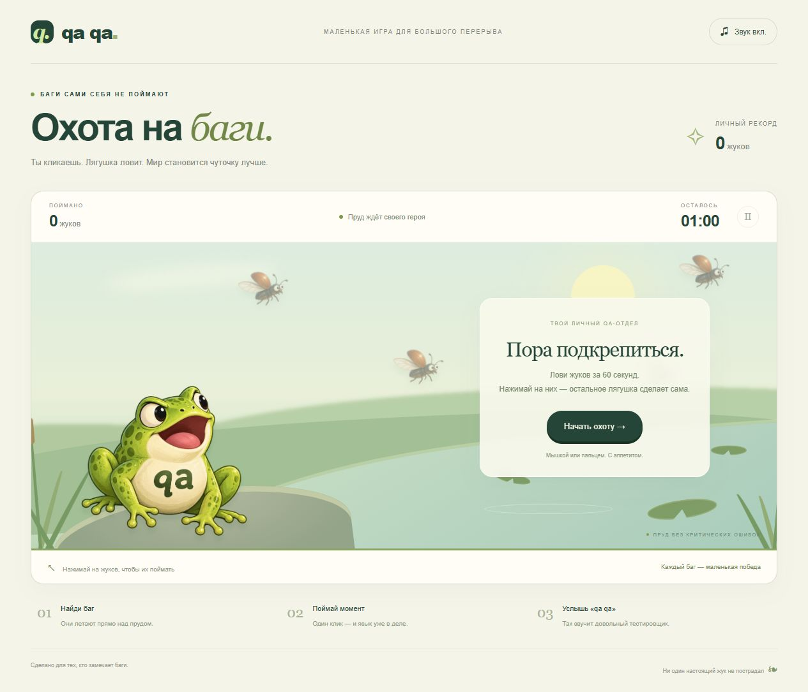

# QA QA — охота на баги

Браузерная игра с лягушкой и жуками из исходной иллюстрации. На груди зелёной лягушки красуется надпись «QA» — она охотится за багами в самом буквальном смысле. Нажмите «Начать охоту», затем нажимайте на летающих жуков. Лягушка хватает их языком, затягивает в рот и ест. Быстрые клики ставятся в очередь. Раунд длится 60 секунд; рекорд хранится в браузере. Периодически появляется «qa qa!» и звучат два кваканья и реплика через Speech Synthesis, если браузер поддерживает голос. Звук включается после первого действия игрока.



Мышь, касания, Tab + Enter для жуков; Escape — пауза. При уходе со вкладки раунд ставится на паузу. Есть выключение звука и поддержка prefers-reduced-motion.

## Локальный запуск

Нужен Node.js 22 или новее. Установка npm-пакетов не требуется.

```powershell
cd D:\gpt\qa-frog
node server.mjs
```

Открыть http://localhost:8080. Проверки: `node --test`.

## Docker

```powershell
docker build --platform linux/amd64 --provenance=false --sbom=false -t qa-frog:1.0.0 .
docker run --rm --name qa-frog -p 8080:8080 qa-frog:1.0.0
```

Для проверки другого порта: `docker run --rm -e PORT=9000 -p 9000:9000 qa-frog:1.0.0`.

Образ использует Node 24 Alpine, пользователя node с UID 1000, слушает `0.0.0.0:$PORT` (по умолчанию 8080), возвращает `200` на `/health`, корректно обрабатывает SIGTERM. Нет базы данных, volumes, runtime npm-зависимостей или внешних CDN. В образ попадают только сервер и public; документы, скриншоты и локальные настройки исключены.

## Состав

- `public/` — игра, стили, спрайты; `round.js` — состояние раунда.
- `server.mjs` — HTTP-сервер стандартной библиотеки Node.
- `tests/` — проверки таймера, паузы, завершения захвата, HTTP и запрета доступа вне public.
- `docs/` — исходная иллюстрация и скриншоты проверки.

Спрайты получены встроенным ImageGen из исходной картинки. Краткий промпт лягушки: «Изолировать ту же лягушку qa целиком на прозрачном фоне, сохранить стиль, убрать вытянутый язык и окружение, оставить открытый рот». Промпт жука: «Один летающий каштановый жук из исходной картинки, большие глаза, раскрытые крылья, прозрачный фон».
